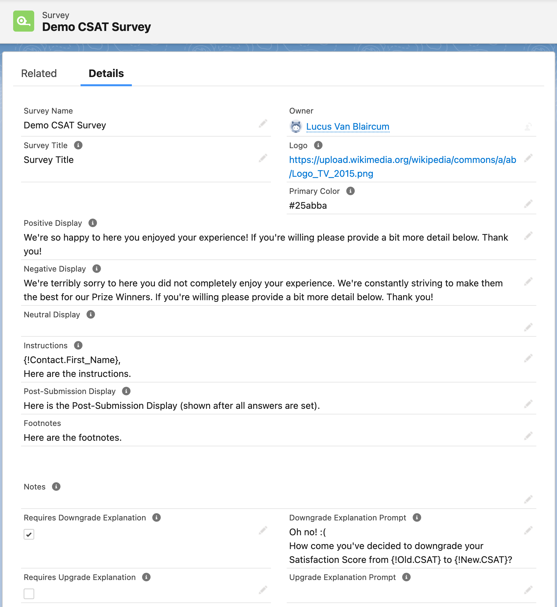
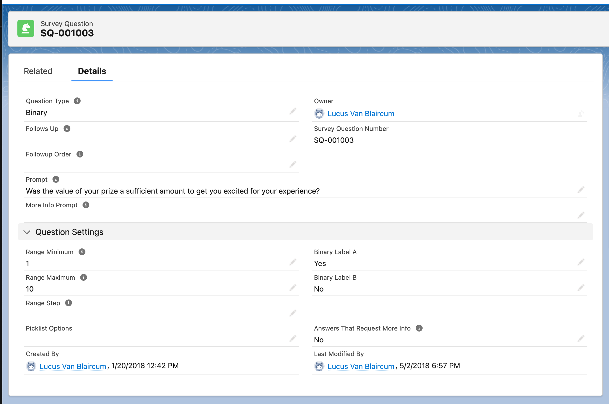
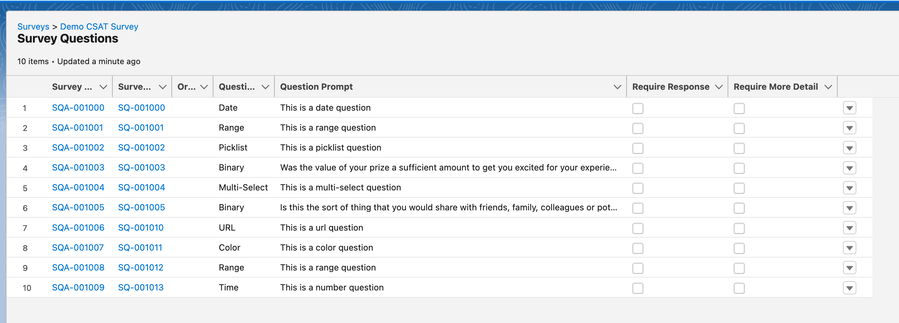
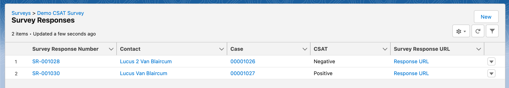
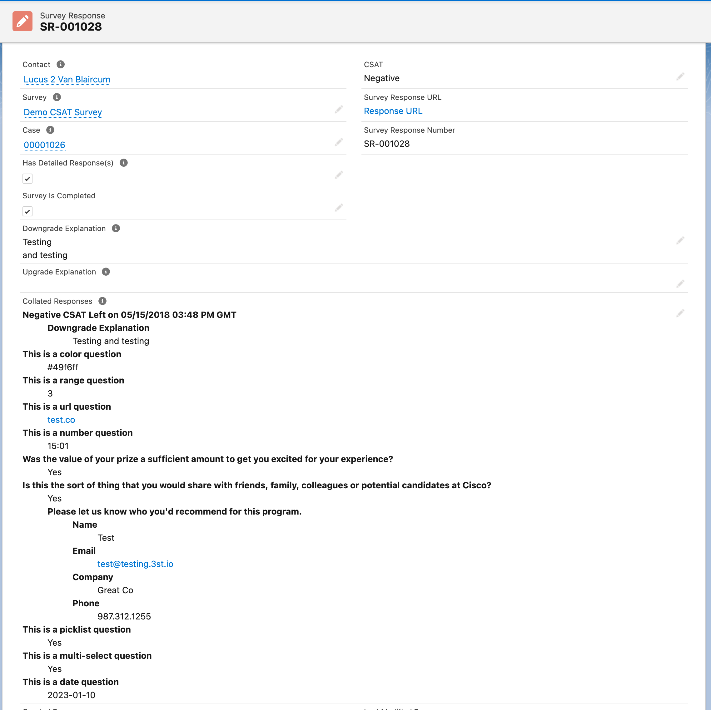
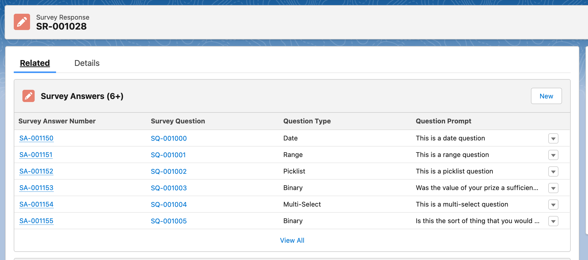
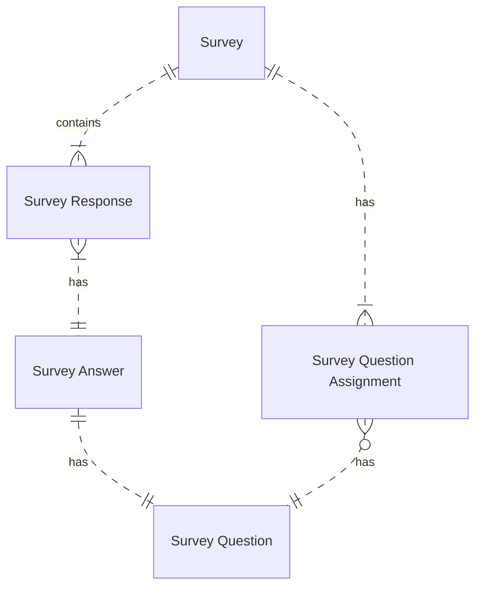

# 3Sigma Surveys SFDX Project

This repo holds the code for the 3Sigma Surveys managed package.

The latest version of the packaged contents is available in the `/bin/latest.zip` archive.

An example survey can be found [here](https://x3st-surveys-dev-ed.my.salesforce-sites.com/?srId=a021N00000ZfWeaQAF).

 

# Setup

 

# Responses

 

# Entity Relations

